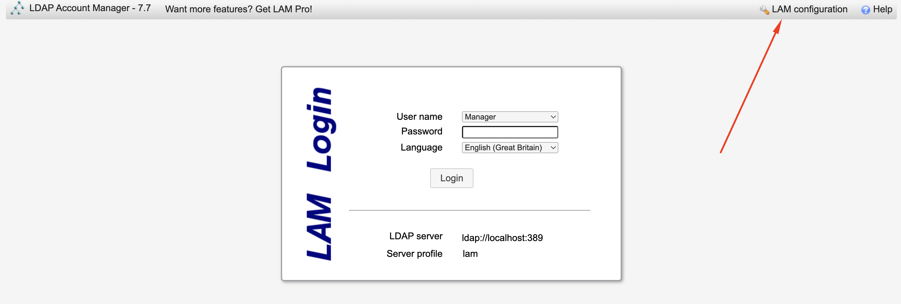
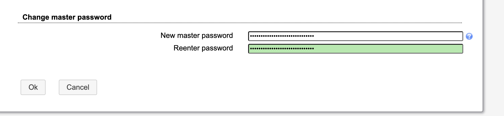
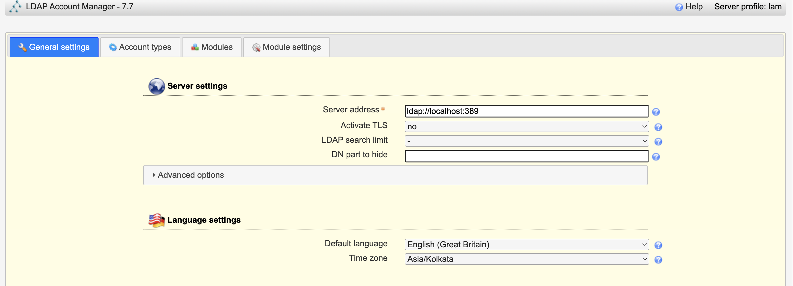
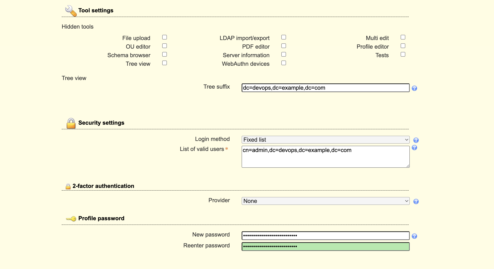
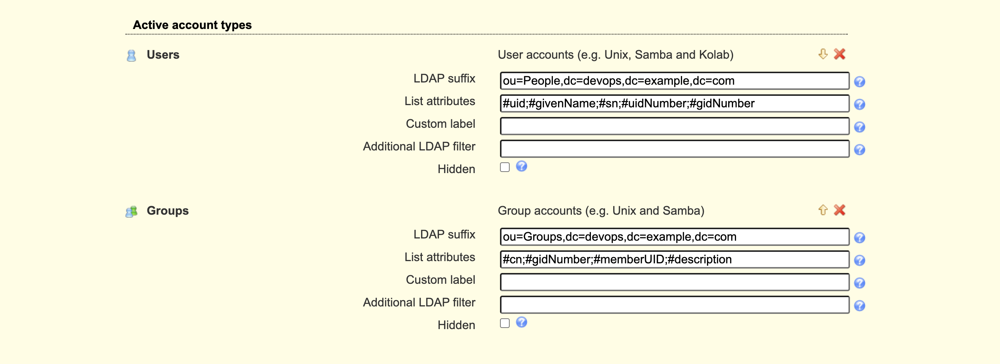
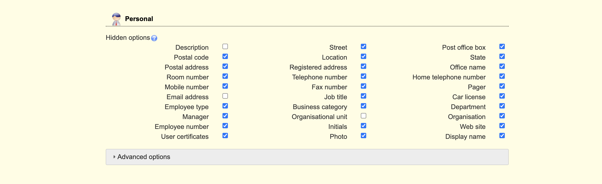
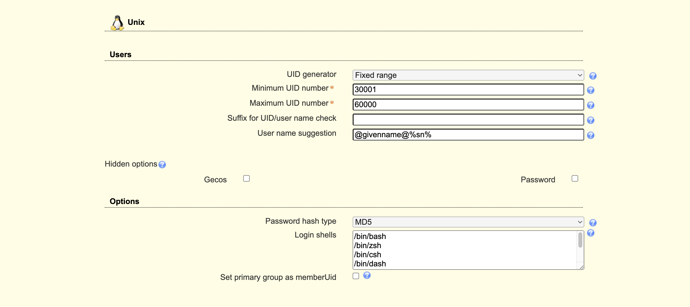
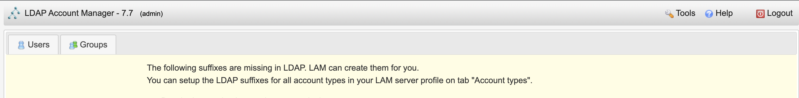
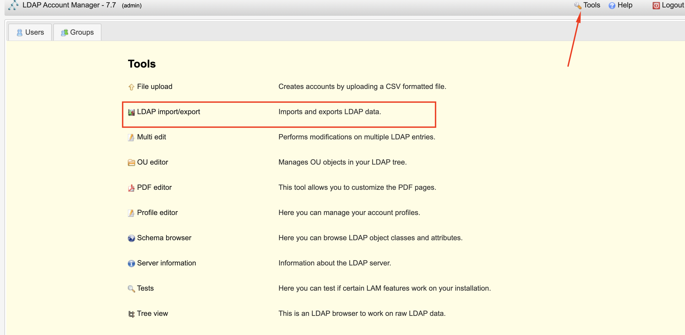
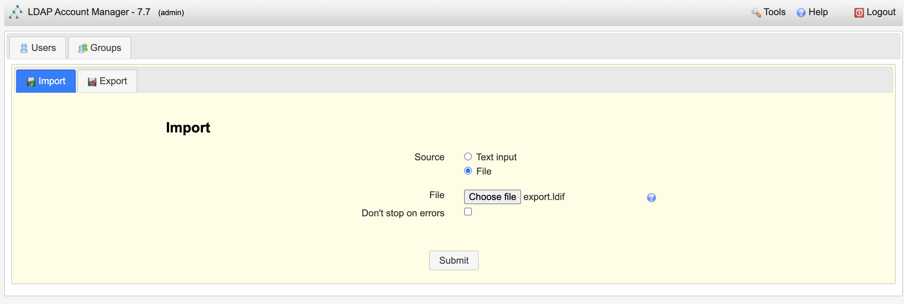

# LDAP Account Manager

LDAP Account Manager (LAM) is a web frontend for managing entries (e.g. users, groups, DHCP settings) stored in an LDAP directory. The LDAP Account Manager tool was designed to make LDAP management as easy as possible for the user.

LAM ease administration of LDAP entries by abstracting the technical details of LDAP and allowing administrators and users without technical background to manage LDAP server. If needed, experienced users can directly edit LDAP entries via the integrated LDAP browser.

The latest LDAP server have `back-mdb` and old db configuration deprecated. `back-mdb` is the "primary" storage database backend. This backend manages directory objects in an embedded database and is more fully featured than other backends. `back-mdb` is superior to the deprecated `back-hdb` and `back-bdb` backends.

Features of LDAP Account Manager

* Manages Unix, Samba 3/4, Kolab 3, Kopano, DHCP, SSH keys, a group of names and much more
* Has support for 2-factor authentication
* Support for account creation profiles
* CSV file upload
* Automatic creation/deletion of home directories
* setting file system quotas
* PDF output for all accounts
* schema and LDAP browser
* manages multiple servers with different configurations

Once the service deployed, ou may have to do some manual configuration from the UI. `http://(server’s hostname or IP address)/lam`

The LDAP Account Manager Login form will be shown. We need to set our LDAP server profile by clicking on `[LAM configuration]` at the upper right corner. default password will me `lam`

## Edit `General Settings` > `Change master password`

Change the master password

## Edit `Server Profiles` > `General Settings`

## Edit `Server Profiles` > `Account Types`

## Edit `Server Profiles` > `Module Settings`

* Warning message for LAM directory structure. If youare configuring LDAP as a first time, then click `create`, else `cancel` and import the existing `ldif` files for `users` and `groups`

## Migration from Old LDAP [`back-bdb`] to New LDAP [`back-mdb`]

If you are using LDAP with [`back-mdb`] backend and then you have to migate your ldap data by exporting from the current LDAP and import the data to new LDAP once it is deployed. 

